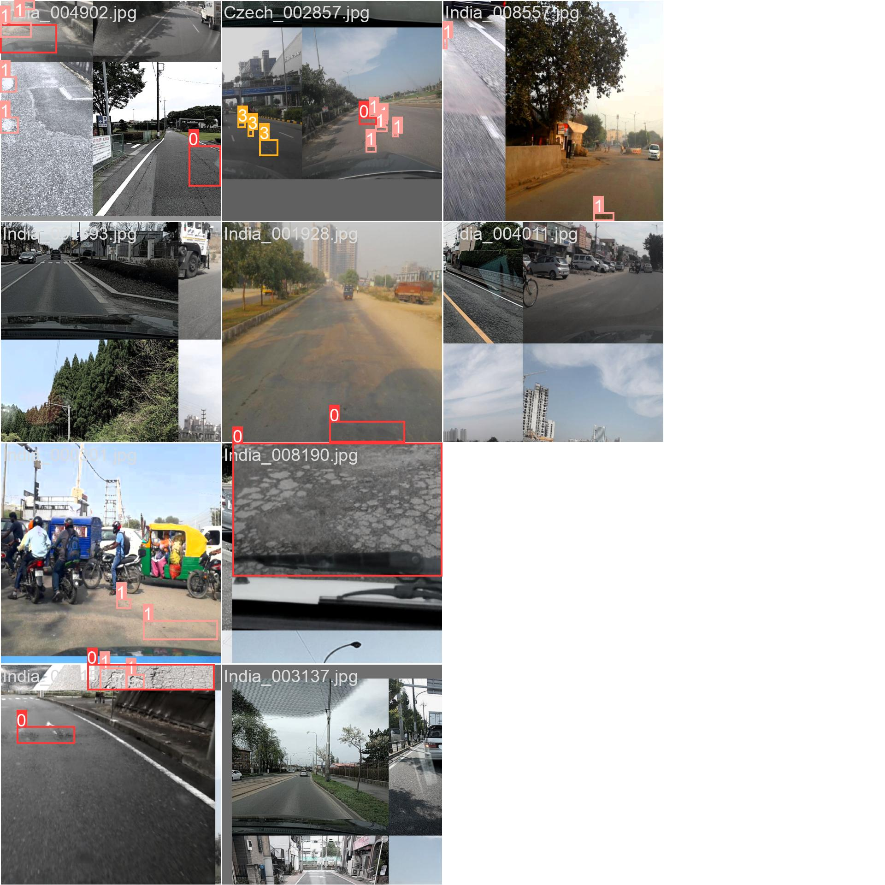

# TRINIT-TheThreeMusketeers-ML

#### video link: https://drive.google.com/drive/folders/113GMsWvdYQhvsIYLvfjYLQcyItEqbhaO?usp=sharing

# Table of Contents

- [TRINIT-TheThreeMusketeers-ML](#trinit-thethreemusketeers-ml)
  - [video link: https://drive.google.com/drive/folders/113GMsWvdYQhvsIYLvfjYLQcyItEqbhaO?usp=sharing](#video-link-httpsdrivegooglecomdrivefolders113gmswvdyqhvsiylvfjylqcyiteqbhaouspsharing)
- [Table of Contents](#table-of-contents)
- [Problem Statement](#problem-statement)
- [Idea](#idea)
    - [Web Application (User Interface)](#web-application-user-interface)
      - [User Authentication:](#user-authentication)
      - [Login Page](#login-page)
      - [Signup Page](#signup-page)
      - [Photo Upload:](#photo-upload)
      - [Upload Image](#upload-image)
    - [Mobile Application (User Interface)](#mobile-application-user-interface)
      - [User Authentication:](#user-authentication-1)
      - [Login Page](#login-page-1)
      - [Signup Page](#signup-page-1)
      - [Photo Upload:](#photo-upload-1)
      - [Homepage](#homepage)
      - [Capture Photo from Camera](#capture-photo-from-camera)
      - [Choose Photo from Gallery](#choose-photo-from-gallery)
    - [Admin Dashboard (Web Interface)](#admin-dashboard-web-interface)
      - [Authentication:](#authentication)
      - [Road Data Management:](#road-data-management)
      - [Filtered Road Images](#filtered-road-images)
      - [Detailed View of Damaged Road:](#detailed-view-of-damaged-road)
      - [Map Visualization:](#map-visualization)
      - [Damaged Road Images Flagged on Map](#damaged-road-images-flagged-on-map)
    - [Machine Learning Component (Backend)](#machine-learning-component-backend)
      - [Object Detection:](#object-detection)
      - [Integration with Web and Mobile Apps:](#integration-with-web-and-mobile-apps)
      - [Firebase Integration:](#firebase-integration)
    - [Model Performance](#model-performance)
      - [Train Batch 0](#train-batch-0)
      - [Train Batch 1](#train-batch-1)
      - [Train Batch 2](#train-batch-2)
      - [Validation Batch 0 labels](#validation-batch-0-labels)
      - [Validation Batch 0 predictions](#validation-batch-0-predictions)
      - [Validation Batch 1 labels](#validation-batch-1-labels)
      - [Validation Batch 1 predictions](#validation-batch-1-predictions)
      - [Metrics](#metrics)
      - [Confusion Matrix](#confusion-matrix)
      - [PR Curve](#pr-curve)
      - [F1 Curve](#f1-curve)
      - [Labels Correlogram](#labels-correlogram)
      - [Results](#results)
    - [Deployment and Scalability](#deployment-and-scalability)
      - [Firebase Integration:](#firebase-integration-1)
      - [Cloud Deployment:](#cloud-deployment)
      - [Continuous Monitoring and Improvement:](#continuous-monitoring-and-improvement)

# Problem Statement
Manual inspection of road conditions is a time-consuming and labor-intensive task, leading to delays in identifying and repairing damaged roads. The goal is to develop a classification model capable of automatically detecting and categorizing road damage from images (captured through CC cameras,phone,etc.).

# Idea
The Road Damage Detection System revolutionizes infrastructure maintenance by harnessing the power of modern technology. The live feeds from CCTV cameras can be directly fed into the backend/model, to detect the damaged roads. Also through a seamless integration of web and mobile interfaces, users can effortlessly upload images of damaged roads, enabling swift identification and categorization of road damages. Leveraging state-of-the-art machine learning algorithms, such as YOLO (You Only Look Once), the system accurately detects and locates various types of road damages, including longitudinal cracks, transverse cracks, alligator cracks, and potholes. An intuitive admin dashboard provides administrators with a comprehensive overview of the uploaded road data, empowering them to efficiently manage and visualize the road damages on an interactive map. By streamlining the inspection process and facilitating timely repairs, the Road Damage Detection System ensures safer and well-maintained road networks, ultimately enhancing infrastructure management and road safety for communities worldwide.

Let's break down the product into its components: the web application for users to upload photos, the mobile app for the same purpose, and the admin dashboard for managing and visualizing the data.

### Web Application (User Interface)

#### User Authentication:
- The web application provides a user authentication system powered by Firebase Authentication.
- Users can sign up for an account or log in using their email and password.
- Firebase Authentication handles user registration, login, and password reset functionalities securely.

#### Login Page

#### Signup Page

#### Photo Upload:
- Authenticated users can upload photos of damaged roads through the web application.
- The photo upload feature includes an intuitive user interface allowing users to select and upload images easily.
- Upon uploading, the photos are securely stored in Firebase Cloud Storage.

#### Upload Image

# USER DEMO [website]

https://github.com/srujan-landeri/TRINIT-TheThreeMusketeers-ML/assets/66351075/5d6662ba-e8f5-4697-9e9d-3711ad23d43f

### Mobile Application (User Interface)

#### User Authentication:
- The mobile application also integrates Firebase Authentication for user authentication.
- Users can sign up for an account or log in using their email and password, similar to the web application.
- Firebase Authentication ensures a seamless and secure login experience for mobile users.

#### Login Page

#### Signup Page

#### Photo Upload:
- Similar to the web application, the mobile app allows users to upload photos of damaged roads.
- The mobile app interface provides a user-friendly experience optimized for mobile devices.
- The user can choose a photo from the gallery, or take a photo from the inbuilt cameras.
- Uploaded photos are stored securely in Firebase Cloud Storage, just like in the web application.

#### Homepage

#### Capture Photo from Camera

#### Choose Photo from Gallery

### Admin Dashboard (Web Interface)

#### Authentication:
- The admin dashboard requires authentication for access to sensitive data and functionalities.
- Only authorized users with administrative privileges can access the admin dashboard.
- Firebase Authentication is used to authenticate admin users securely.

#### Road Data Management:
- The admin dashboard provides a comprehensive overview of all uploaded photos of damaged roads.
- Admins can view, filter, and manage the road data, categorized by the type of damage (e.g., longitudinal crack, transverse crack, pothole).
- The dashboard includes features for searching, sorting, and filtering road data to facilitate efficient management.

#### Filtered Road Images

#### Detailed View of Damaged Road:

#### Map Visualization:
- One of the key features of the admin dashboard is the map visualization of the damaged roads.
- The geo data from images will be extracted, so that the exact location of the damaged road can be known.
- Admins can view the damaged roads overlaid on a map, color-coded and labeled according to the type of damage.
- Google Maps API integration is used to render the map and display the road data visually.

#### Damaged Road Images Flagged on Map

https://github.com/srujan-landeri/TRINIT-TheThreeMusketeers-ML/assets/66351075/8500f26b-ba23-4d6f-a725-20244ccb0f10

### Machine Learning Component (Backend)

#### Object Detection:
- The machine learning component of the system utilizes YOLO (You Only Look Once) object detection algorithm.
- YOLO is trained to detect and locate various types of road damages, including longitudinal cracks, transverse cracks, alligator cracks, and potholes.
- The machine learning model is trained on a diverse dataset of road images annotated with bounding boxes indicating the location and type of damage.

#### Integration with Web and Mobile Apps:
- Upon user photo upload through the web or mobile app, the images are processed using the YOLO algorithm for road damage detection.
- The detected damages are categorized and stored along with the uploaded photos in Firebase Realtime Database.
- The web and mobile apps retrieve and display the detected damages from the database, providing users with insights into road conditions.

#### Firebase Integration:

### Model Performance

#### Train Batch 0

#### Train Batch 1

#### Train Batch 2

#### Validation Batch 0 labels

#### Validation Batch 0 predictions

#### Validation Batch 1 labels

#### Validation Batch 1 predictions

#### Metrics

#### Confusion Matrix

#### PR Curve

#### F1 Curve

#### Labels Correlogram

#### Results

### Deployment and Scalability

#### Firebase Integration:
- The Road Damage Detection System leverages Firebase services for authentication, cloud storage, and real-time database.
- Firebase provides a scalable and reliable platform for hosting web and mobile applications, as well as storing and managing data securely.

#### Cloud Deployment:
- Ideally, The web application, mobile application, and admin dashboard will be deployed to cloud hosting services such as Firebase Hosting or other platforms like AWS, Google Cloud Platform, or Azure.
- Cloud deployment ensures high availability, scalability, and reliability of the system, allowing users to access the applications from anywhere and at any time.

#### Continuous Monitoring and Improvement:
- The system undergoes continuous monitoring to ensure optimal performance and reliability.
- Usage analytics and feedback from users and admins are collected to identify areas for improvement and optimization.
- Regular updates and enhancements are implemented to address user needs and improve the overall user experience.

By implementing the Road Damage Detection System with separate interfaces for web, mobile, and admin, along with a robust backend powered by machine learning, the system offers a comprehensive solution for identifying and managing road damages efficiently. The integration with Firebase and cloud deployment ensures scalability, reliability, and security, making it a valuable tool for infrastructure maintenance and management.

---------------------------------------------------------------------------------------------------------------------------------------------------------------------------------------------------------------------
